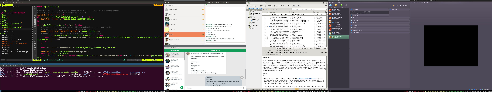

After over 3 months of oscillating between despair over how dysfunctional various desktop environments are (I went through Ubuntu Unity, Gnome3, Mate, Cinnamon, KDE4, Enlightenment, back to KDE4, LXDE, back to KDE4) and contentment that I can work with this DE or the other, I have finally realized that the best desktop environment is one that isn't.

After a month of using i3 for 6 months now, I can now say for certain that tiling window managers are all that a developer needs.

- It's a mouse free Nirvana where moving and resizing windows is a breeze.
- Window switching becomes a task that your muscle memory will execute subconsciously. You won't realize how bad a UI design/usage pattern Alt-tabbing is until you use this.
- Multi-monitor support is configurable to a tee.
- Compared to Plasma Workspace process (KDE) and Ubuntu, this has a tiny RAM footprint. This is a huge plus for me! I have only 8G of RAM and have to constantly test a massive WebGL webapp on my browser and run a server on a VM.
- I love the fact that I can backup the configuration in a git repo. (This can probably done in KDE as well).

Beware though: it takes effort to setup and configure it just the way you'd like it.

